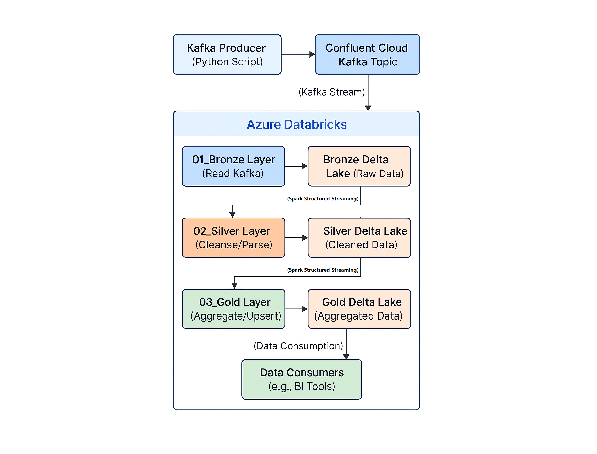

# Real-Time Rides Data Pipeline

## Project Overview

This project demonstrates a scalable, real-time data pipeline built on **Azure Databricks** and **Confluent Cloud Kafka**. The pipeline processes simulated ride-sharing data, transforming it through a Medallion Architecture (Bronze -> Silver -> Gold) and providing real-time analytics.

## Architecture



This diagram illustrates the end-to-end flow of data: from the Kafka Producer to Confluent Cloud, through the Medallion Architecture layers (Bronze, Silver, Gold) within Azure Databricks, and finally to data consumers for analytics and reporting.

## Technologies Used

* **Cloud Platform:** Azure
* **Data Lake:** Delta Lake
* **Streaming Platform:** Apache Kafka (Confluent Cloud)
* **Data Processing:** Apache Spark Structured Streaming (Databricks)
* **Languages:** Python (PySpark, Kafka Producer)
* **Orchestration:** Databricks Jobs (or implied from notebooks)

## Data Model

The pipeline processes ride-sharing data with a schema including:
* `ride_id`
* `driver_id`
* `passenger_id`
* `start_time`
* `end_time`
* `fare`
* `status`
* `event_timestamp`
* `timestamp` (Kafka timestamp)

## Pipeline Stages (Medallion Architecture)

### 1. Bronze Layer (Raw Ingestion)
* **Source:** Real-time stream from Kafka.
* **Processing:** Reads raw JSON messages from Kafka, casts them to string, and lands them directly into a Bronze Delta table. Minimal transformation, acting as a data lake landing zone.

### 2. Silver Layer (Cleaned & Enriched)
* **Source:** Bronze Delta table (streaming read).
* **Processing:** Parses raw JSON messages into a structured schema, filters out malformed records, and performs basic data type conversions. Enriched data is written to a Silver Delta table.

### 3. Gold Layer (Aggregated & Transformed)
* **Source:** Silver Delta table (streaming read).
* **Processing:** Performs business-level aggregations and transformations, such as hourly ride counts per driver and identifying suspicious rides. Data is continuously updated (upserted) into a Gold Delta table using `foreachBatch` and Delta Lake's `MERGE` operation.

### Detailed Setup Instructions

To set up and run this real-time data pipeline, follow these steps:

#### **1. Azure Setup**

1.  **Azure Account:** Ensure you have an active Azure subscription.
2.  **Azure Databricks Workspace:**
    * Navigate to the Azure Portal.
    * Search for "Azure Databricks" and create a new Databricks Workspace in your preferred region.
    * Choose a pricing tier (e.g., Premium for enhanced security features like VNet injection or Standard for basic use).
3.  **Azure Storage Account (ADLS Gen2):**
    * Create a new Azure Storage Account (StorageV2, Data Lake Storage Gen2 enabled) in the same region as your Azure Databricks Workspace. This will serve as the underlying storage for your Delta Lake tables.
    * Create a file system (container) within your storage account (e.g., `realtime-rides-data`).
    * **Configure Access:** The recommended approach for production is to use a Service Principal or Managed Identities. For quick setup, you might use an Access Key (less secure for production but simpler for testing).

#### **2. Confluent Cloud Kafka Setup**

1.  **Confluent Cloud Account:** Sign up for a free Confluent Cloud account if you don't have one.
2.  **Create a Kafka Cluster:**
    * In the Confluent Cloud UI, create a new Kafka cluster. Choose a cloud provider (e.g., Azure) and a region close to your Azure Databricks workspace for lower latency.
    * Select a cluster type (e.g., Basic or Standard for this project).
3.  **Create Kafka Topic:**
    * Navigate to your newly created Kafka cluster.
    * Go to "Topics" and create a new topic named `rides_stream`. Configure default settings or adjust as needed (e.g., 6 partitions, 7 days retention).
4.  **Generate API Keys:**
    * Go to "API Keys" under your Kafka cluster.
    * Generate a new API key and secret. **Immediately copy the API Key and API Secret.** You will not be able to retrieve the secret again. **These are highly sensitive credentials.**

#### **3. Databricks Cluster and Secrets Configuration**

1.  **Create a Databricks Cluster:**
    * In your Azure Databricks workspace, go to "Compute" and create a new cluster.
    * **Cluster Mode:** Single Node (for development/testing) or Standard (for production).
    * **Databricks Runtime Version:** Choose a recent LTS version (e.g., `13.3 LTS (Scala 2.12, Spark 3.4.1)` or newer, ensuring it includes Photon for performance).
    * **Node Type:** Select a cost-effective instance type for testing (e.g., `Standard_DS3_v2` for worker and driver).
    * **Autoscaling:** Enable autoscaling for efficient resource usage if using Standard mode.
    * **Termination:** Set an idle termination time (e.g., 30-60 minutes) to save costs.
    * **Note:** Photon is highly recommended for performance, so ensure it's enabled if available for your chosen runtime.

2.  **Configure Databricks Secrets for Kafka Credentials:**
    * **Crucial for Security:** Instead of hardcoding Kafka API keys and secrets in your notebooks, use Databricks Secrets.
    * **Create a Secret Scope:**
        * Open your Databricks workspace URL.
        * Append `/secrets/createScope` to your workspace URL (e.g., `https://adb-YOUR_WORKSPACE_ID.azuredatabricks.net/?o=YOUR_ORG_ID#secrets/createScope`).
        * Give your scope a name (e.g., `kafka_credentials_scope`). Choose `Databricks` as the backend type.
    * **Add Secrets:**
        * Go to "Secrets" in the sidebar.
        * Select your new `kafka_credentials_scope`.
        * Add a new secret for your Kafka API Key (e.g., `kafka_api_key`) and paste your API Key as the value.
        * Add another secret for your Kafka API Secret (e.g., `kafka_api_secret`) and paste your API Secret as the value.
    * **Reference in Notebooks:** Your notebooks in the `src/` folder are already configured to read these secrets using `dbutils.secrets.get()`.

3.  **Install Libraries on Databricks Cluster:**
    * Go to "Compute", click on your cluster, then select the "Libraries" tab.
    * Install the necessary libraries from PyPI:
        * `confluent-kafka` (This might not be strictly needed on the Databricks cluster itself if only your local producer uses it, but good to have if you intend to run any Kafka client code directly from a notebook).
        * The Spark-Kafka connector is usually pre-installed with Databricks Runtime, but if you face issues, ensure `org.apache.spark:spark-sql-kafka-0-10_2.12:YOUR_SPARK_VERSION` (replace `YOUR_SPARK_VERSION` with your cluster's Spark version, e.g., `3.4.1`) is attached as a Maven library.

#### **4. Run the Pipeline**

1.  **Clone / Import Notebooks:**
    * In your Databricks workspace, import the `.py` files from the `src/` folder of this GitHub repository into your Databricks workspace.
2.  **Run Kafka Producer:**
    * Open a local terminal or command prompt.
    * Navigate to the `src/` directory where `kafka_rides_producer.py` is located.
    * Ensure you have the `confluent-kafka` Python library installed locally (`pip install confluent-kafka`).
    * **Update the `kafka_rides_producer.py` script:** Replace the placeholders with your actual Kafka topic name, bootstrap servers, and the API key/secret you got from Confluent Cloud.
        ```python
        # In kafka_rides_producer.py
        # ...
        'bootstrap.servers': 'YOUR_BOOTSTRAP_SERVERS', # e.g., pkc-xxxxx.region.confluent.cloud:9092
        'sasl.username': 'YOUR_API_KEY',
        'sasl.password': 'YOUR_API_SECRET',
        # ...
        # topic = 'YOUR_TOPIC_NAME' # Should be 'rides_stream' as per setup
        ```
    * Run the producer: `python kafka_rides_producer.py`
    * Let it run continuously in the background to generate data.
3.  **Run Databricks Notebooks:**
    * Attach your created Databricks cluster to all your imported notebooks.
    * Run the notebooks in the following order:
        1.  `01_bronze_realtime_rides.py` (Start this stream)
        2.  `02_silver_realtime_rides.py` (Start this stream after Bronze is running)
        3.  `03_gold_realtime_rides.py` (Start this stream after Silver is running)
        * **Verify Streams:** Observe the Spark Structured Streaming dashboards within each notebook to confirm data flow and processing.
    * **Verify Gold Layer Data:** Run `Verify_Gold_Layer_Data.py` to query your Gold Delta tables and see the aggregated results. This notebook can be run periodically to check data.

### Key Features & Learnings

This project provided hands-on experience and valuable insights into building robust real-time data pipelines:

* **Real-time Data Ingestion:** Successfully implemented data ingestion from a simulated source into Apache Kafka on Confluent Cloud, demonstrating capabilities in handling high-throughput streams.
* **Medallion Architecture:** Applied the Medallion Architecture (Bronze, Silver, Gold layers) for structured data refinement, ensuring data quality, reliability, and usability at each stage.
* **Apache Spark Structured Streaming:** Leveraged Spark Structured Streaming for continuous, fault-tolerant processing of real-time data on Azure Databricks.
* **Delta Lake Implementation:** Utilized Delta Lake for building reliable data lake layers with ACID properties, schema enforcement, and efficient upsert operations (e.g., `MERGE INTO`).
* **Complex Data Transformation:** Performed advanced data transformations and aggregations, including parsing nested JSON, calculating hourly ride statistics, and identifying "suspicious" ride patterns.
* **Incremental Processing:** Implemented `foreachBatch` logic in the Gold layer to handle incremental updates and ensure consistent, real-time analytics.
* **Cloud Integration & Security:** Gained experience integrating Azure Databricks with Confluent Cloud Kafka and implemented secure credential management using Databricks Secrets.
* **Scalability & Performance:** Designed the pipeline with scalability in mind, leveraging Databricks' distributed computing capabilities and Photon engine (if used).

### Project Screenshots

Here are some visual demonstrations of the pipeline's components and results:

#### **Kafka & Confluent Cloud Setup**


#### **Azure Databricks Configuration**


#### **Bronze Layer (Raw Ingestion)**


#### **Silver Layer (Cleaned & Enriched)**


#### **Gold Layer (Aggregated & Transformed)**


#### **Verified Gold Layer (Querying on Gold delta table)**


### Conclusion / Future Enhancements (Optional)

This project successfully demonstrates the build of a robust real-time data pipeline. Possible future enhancements could include:
* Integrating with a real-time dashboarding tool (e.g., Power BI, Tableau, Grafana) to visualize Gold layer data.
* Adding more complex stream processing logic for anomaly detection or predictive analytics.
* Implementing CI/CD pipelines for automated deployment of notebooks and infrastructure.
* Setting up alerts and monitoring for pipeline health and data quality.
